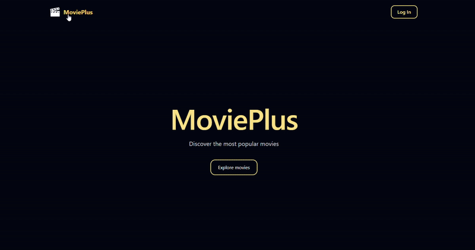

# **Sprint 7: Angular Movies Application with Firebase Authentication**

A modern movie discovery web application built with Angular 21, featuring Firebase authentication, real-time movie data from TMDB API, and a responsive user interface with Tailwind CSS.

**Live Demo**: <https://sprint7-movies-angular.vercel.app/>

---

## ** Project Overview**

This application enables users to explore popular movies, view detailed information including cast and similar recommendations, and manage their authentication state. Built as part of an IT Academy bootcamp sprint, it demonstrates modern Angular development practices, Firebase integration, and external API consumption.

---

## ** Key Features**

* **Firebase Authentication**: Secure user login/registration with email/password and Google OAuth  
* **Movie Discovery**: Browse popular movies with infinite scroll functionality  
* **Detailed Movie Information**: View comprehensive details including synopsis, runtime, ratings, genres, and release dates  
* **Cast Information**: Display main cast members with photos and character names  
* **Similar Movies**: Discover related movies using TMDB's intelligent recommendation algorithm  
* **Real-time State Management**: Reactive data handling using Angular Signals  
* **Responsive Design**: Mobile-first approach with Tailwind CSS  
* **Protected Routes**: Authentication-based navigation and access control  
* **Dynamic Routing**: Navigate between movies while maintaining state

---

## ** Tech Stack**

| Technology | Purpose |
| ----- | ----- |
| **Angular 21** | Modern web framework with Standalone Components |
| **TypeScript** | Type-safe development |
| **Firebase** | Authentication and user management |
| **TMDB API** | Movie data and recommendations |
| **Angular Signals** | Reactive state management |
| **Tailwind CSS** | Utility-first responsive styling |
| **Reactive Forms** | Form handling and validation |
| **Angular Router** | Navigation and route guards |
| **RxJS** | Asynchronous data streams |

---

## ** Getting Started**

### **Prerequisites**

Ensure you have the following installed:

* Node.js (v18 or higher recommended)  
* npm (comes with Node.js)  
* Angular CLI (v21 or higher)

```bash

npm install \-g @angular/cli
```

### **Installation**

1. **Clone the repository**

```bash  
git clone https://github.com/yourusername/sprint7-movies-angular.git

cd sprint7-movies-angular
```

2. **Install dependencies**

```bash

npm install
```

3. **Configure environment variables**

Create your environment files:

* `src/environments/environment.development.ts`  
* `src/environments/firebase.config.ts`

```typescript  
*// environment.development.ts*  
export const environment \= {  
  production: false,  
  tmdbApiKey: 'YOUR\_TMDB\_API\_KEY',  
  tmdbBaseUrl: 'https://api.themoviedb.org/3',  
  tmdbImageBaseUrl: 'https://image.tmdb.org/t/p'  
};

*// firebase.config.ts*  
export const firebaseConfig \= {  
  apiKey: "YOUR\_FIREBASE\_API\_KEY",  
  authDomain: "your-project.firebaseapp.com",  
  projectId: "your-project-id",  
  storageBucket: "your-project.appspot.com",  
  messagingSenderId: "YOUR\_SENDER\_ID",  
  appId: "YOUR\_APP\_ID"

};
```

4. **Start development server**

```bash

ng serve 
```

The application will open automatically at `http://localhost:4200/`

---


## ** Testing**

Run the test suite:

```bash  
ng test  
```

**Test Coverage:**  
- Service methods and API calls  
- Component logic and rendering  
- Form validation  
- Authentication flows  
- HTTP interceptors

---

## ** Project Structure*  




---

## ** Project Structure*  

```
sprint7-movies-angular

├──src
│   ├──app
│   │   ├──components
│   │   │   ├──home
│   │   │   │   ├──home.css
│   │   │   │   ├──home.html
│   │   │   │   └──home.ts
│   │   │   ├──login
│   │   │   │   ├──login.css
│   │   │   │   ├──login.html
│   │   │   │   ├──login.spec.ts
│   │   │   │   └──login.ts
│   │   │   ├──movie-info
│   │   │   │   ├──movie-info.css
│   │   │   │   ├──movie-info.html
│   │   │   │   ├──movie-info.spec.ts
│   │   │   │   └──movie-info.ts
│   │   │   ├──movie-list
│   │   │   │   ├──movie-list.css
│   │   │   │   ├──movie-list.html
│   │   │   │   ├──movie-list.spec.ts
│   │   │   │   └──movie-list.ts
│   │   │   ├──navbar
│   │   │   │   ├──navbar.css
│   │   │   │   ├──navbar.html
│   │   │   │   └──navbar.ts
│   │   │   └──register
│   │   │   │   ├──register.css
│   │   │   │   ├──register.html
│   │   │   │   ├──register.spec.ts
│   │   │   │   └──register.ts
│   │   ├──mapper
│   │   │   └──movie.mapper.ts
│   │   ├──models
│   │   │   ├──credits.interface.ts
│   │   │   ├──movie-api.interface.ts
│   │   │   ├──movie-details.interface.ts
│   │   │   └──movie.interface.ts
│   │   ├──services
│   │   │   ├──auth.spec.ts
│   │   │   ├──auth.ts
│   │   │   ├──movies.spec.ts
│   │   │   └──movies.ts
│   │   ├──validators
│   │   │   └──password-match.validator.ts
│   │   ├──app.config.ts
│   │   ├──app.css
│   │   ├──app.html
│   │   ├──app.routes.ts
│   │   └──app.ts
│   ├──assets
│   │   └──logo-icon.svg
│   ├──environments
│   │   ├──environment.development.ts
│   │   ├──environment.ts
│   │   └──firebase.config.ts
│   ├──index.html
│   ├──main.ts
│   └──styles.css

```

---

## ** Core Functionality**

### **1. Authentication System**

* **Email/Password Authentication**: Secure registration and login  
* **Google OAuth Integration**: One-click social authentication  
* **Form Validation**: Real-time validation with custom validators  
* **Password Confirmation**: Custom validator ensures passwords match  
* **Protected Routes**: Access control based on authentication state  
* **Persistent Sessions**: Firebase maintains user sessions

### **2. Movie Discovery**

* **Infinite Scroll**: Automatically loads more movies as you scroll  
* **Popular Movies**: Displays trending and highly-rated films  
* **Responsive Grid**: Adapts from 2 to 5 columns based on screen size  
* **Lazy Loading**: Images load only when visible for better performance  
* **Hover Effects**: Interactive cards with smooth animations

### **3. Detailed Movie View**

* **Comprehensive Information**: Title, tagline, synopsis, runtime, ratings  
* **Visual Layout**: Large poster with organized metadata  
* **Genre Tags**: Color-coded genre indicators  
* **Cast Display**: Photos and character names of main actors  
* **Similar Movies**: 6 related films using TMDB's algorithm  
* **Clickable Recommendations**: Navigate to similar movies seamlessly

### **4. State Management**

* **Angular Signals**: Reactive state updates without manual subscriptions  
* **Computed Values**: Derived state calculations  
* **Signal Effects**: Side effects triggered by state changes  
* **Centralized State**: Single source of truth in services

---


## ** Deployment**

<https://sprint7-movies-angular.vercel.app/>


---


## ** Author**

**Nerea Medina Carrasco**

* GitHub: [@nereame96](https://github.com/nereame96)  
* Project: [sprint7-movies-angular](https://github.com/nereame96/sprint7-movies-angular)

